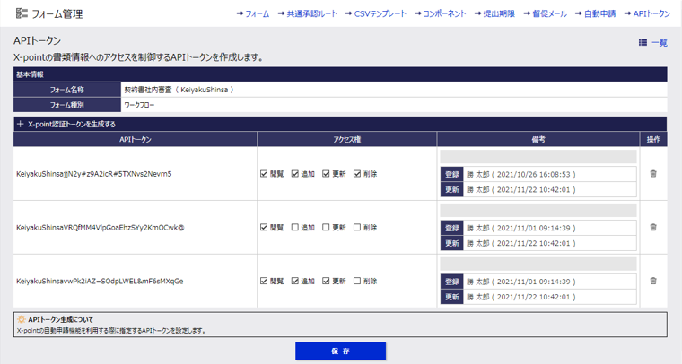
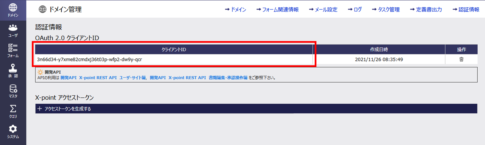

# REST API利用ガイド

* Table of Content
{:toc}

## 1. REST APIの概要

X-pointの各種機能をブラウザ、スマートデバイス・アプリに表示される画面から利用するのではなく、httpsプロトコルを介した通信で画面を介さず直接利用することを目的とする機能です。

### 主な機能

1. 書類の提出
2. 書類のワークフロー操作／状態の取得
3. 書類内容の取得（コメント含む）
4. 添付ファイルの操作
5. 書類PDFの取得
6. 自動申請情報の取得
7. フォーム情報の取得
8. 代理権限情報の取得
9. 承認待ち書類情報取得
10. 書類検索
11. ユーザ情報の取得、登録、更新、削除
12. ユーザグループ情報の取得、登録、更新、削除
13. 役職情報の取得、登録、更新、削除

***注意事項***

* X-pointのブラウザ、スマートデバイスにおける書類ワークフロー操作(書類の提出、承認、保留、差し戻し等)に連動してAPI をリクエストする場合は、書類 Webhook 機能を利用してフォーム毎に指定を行います。
* REST API より書類のワークフロー操作(書類の提出、承認、保留、差し戻し等)を行った場合も、フォームに指定されている書類 Webhook 機能は動作します。
* REST API のリクエストにより X-point サーバーに一定の負荷がかかります。REST API のリクエストが多くなることでX-point の応答速度等に影響を与える場合があります。

## 2. 共通仕様

### 2.1. 基本項目

書類編集・承認操作の REST API の実行ではリクエストを X-point に送信する場合、ログイン ID による認証を必要とする方法、予め登録されたトークンコードを使用する方法の 2 種類があります。接続に使用する情報は http ヘッダに指定する必要があります。
ヘッダに、認証情報、トークンコードいずれかの指定が無い REST API 実行は必ずエラー応答になります。

* 項目

  | 項目 | ヘッダ名 | 説明 |
  |:--|:--|:--|
  | トークン情報 | X-ATLED-Generic-API-Token | ドメインコード、ユーザコード、管理者サイト「ドメイン管理」または「フォーム管理」で生成したトークンコードを`:`で連結して、Base64エンコードした情報を指定する。 |
  | 認証情報 | Authorization | OAuth2認証のアクセストークンを指定する。 |

  レスポンスには送信元がX-pointであることを示す以下のhttpヘッダが設定されます。

  | ヘッダ名 | 設定値 |
  |:--|:--|
  | X-point-API-Sender | X-point [`{ドメインコード}`] |

***注意事項***

* トークン指定で REST API を利用する場合に限り、フォーム・書類に指定されたアクセス権に加え、トークン毎に指定する権限（閲覧、追加、更新、削除）が書類データを操作する際に追加指定されます。
OAuth2 認証のアクセストークンを使用する場合は、フォーム・書類に指定されたアクセス権限で各種機能が動作します。
* システムAPI、ユーザ別API、SCIM APIはAPIトークンによるAPIリクエストはできません。アクセストークンを利用してAPIをリクエストしてください。

### 2.2. APIトークン

API トークンを利用する場合、OAuth2 認証のようにユーザー毎の個別認証を行わずに、トークン情報で REST API を実行することができます。
ユーザーID 毎の認証を行わない為、REST API 実行時には実行ユーザー（誰が申請したか、だれが承認したかなど）を記録するためユーザーコードとドメインコードが必要になります。
トークンコードはデータベースへの追加、更新、削除、閲覧の４種類の対する許可を設定する事ができます。REST API の利用者が許可範囲を超えて操作してしまう事を防止する、REST API を実行するプログラムが漏洩する等した場合に、トークンコードに指定された許可を取り消す事でデータの漏洩・破損を防ぐ事ができます。

* ヘッダ設定形式

   ```text
   X-ATLED-Generic-API-Token: ******************
   ```

* トークンの構成

   トークンコードはX-pointサーバー上で生成される全長40文字のランダム文字列です。

* トークンの種類

   トークンにはフォーム毎のトークンとドメイン毎のトークンの2種類あります。

   | 種類 | 生成画面 | 生成条件 | トークン有効範囲 |
   |:--|:--|:--|:--|
   |フォーム毎のトークン | フォーム管理＞APIトークン | トークンを生成したいフォームの自動申請設定登録が必要。 | トークンに紐づく自動申請を設定したフォームの書類が操作可能。トークンに紐づかない他フォームの書類は操作できません。 |
   | ドメイン毎のトークン | ドメイン管理＞認証情報 | - | ドメイン内の全ての書類が操作可能。|

   ※ 自動申請設定の設定手順等は[管理者機能マニュアル ~自動申請~](https://support.atled.jp/xpoint?id=kb_article_view&sysparm_article=KB0175507)を確認してください。

* トークン管理

  * 有効な API トークンはフォーム毎のトークン、ドメイン毎のトークン共に 10 個の生成が可能です。
  * API トークンはドメインごとに管理可能です。
  * トークンごとに REST API の利用制限を実施します。（閲覧権限、追加権限、更新権限、削除権限）

* トークンでREST APIを実行する場合

   HTTP ヘッダ`X-ATLED-Generic-API-Token`に次の手順で生成したトークン情報をセットします。

  1. ドメインコード、ユーザコード、トークンコードを`:`で挟み連結する

      `{ドメインコード} + ":" + {ユーザコード} + ":" + {トークンコード}`

  2. 連結した文字列全体をBase64でエンコードする

   ***注意事項***

  * OAuth2 認証とトークン情報をどちらも指定した場合、認証したユーザではなくユーザコードで指定されたユーザで REST API が実行されます。

* トークン生成方法

  * フォーム毎のトークン生成方法

  1. X-point管理サイトのフォーム管理画面を開き、`APIトークン`リンクを押下します。

      

  2. APIトークン・設定フォーム一覧画面でAPIトークンを生成したいフォーム名称リンクを押下します。

      

      ***注意事項***
      * フォーム毎のトークンを生成するには自動申請設定の登録が必要です。自動申請設定を登録していないフォームは API トークン・設定フォーム一覧画面に一覧表示されず、フォーム毎のトークンを生成できません。

  3. APIトークン画面で`＋X-point認証トークンを生成する`リンクを押下してAPIトークンを生成します。

      API トークン画面ではトークンの生成、アクセス権の付与、トークンの削除が可能です。API トークンの生成、アクセス権の編集完了後は`保存`ボタンを押下して API トークン情報を保存します。API トークンはフォーム毎に最大 10 トークン生成可能です。

      

  * ドメイン毎のトークン生成方法

  1. X-point管理者サイトのドメイン管理画面を表示し、`認証情報`リンクを押下します。

      

  2. 認証情報画面で`＋X-point認証トークンを生成する`リンクを押下してAPIトークンを生成します。

      APIトークン画面ではトークンの生成、アクセス権の付与、トークンの削除が可能です。
      APIトークンの生成、アクセス権の編集完了後は`APIトークンを保存`ボタンを押下してAPIトークン情報を保存します。
      ドメイン毎のAPIトークンは最大10トークン生成可能です。

      

### 2.3. 認証

APIトークンを用いないREST APIの利用にはX-pointに登録されているユーザによる認証が必要になります。認証にはOAuth2認証がを利用します。

#### 2.3.1. OAuth2認証(Authorization)

HTTPヘッダ`Authorization`に指定されたアクセストークン文字列が示すユーザによる操作としてREST APIが動作し、利用が記録されます。

アクセストークンの発行はOAuth2認証フローを利用して発行する方法とX-point管理者サイトから発行する方法の2種類があります。

【ヘッダ設定形式】

```text
Authorization: Bearer *******
```

##### 【OAuth2認証フローを利用したアクセストークン発行】

X-pointではOAuth2認証フローの`認可コードフロー`を利用してアクセストークンを発行します。

認可コードフローを利用したアクセストークン発行のために必要な手順は下記の通りです。


1. X-point管理者サイトでクライアントIDを生成
  
   認可エンドポイントへリクエストを送信する際、リクエストにクライアントIDを指定する必要があります。

   クライアントIDはX-point管理者サイトで生成でき、ドメイン毎に1つのクライアントIDが生成可能です。

   1. X-point管理者サイトのドメイン管理画面を表示し、`認証情報`リンクを押下します。

      

   2. 認証情報画面で`＋クライアントIDを生成する`リンクを押下してクライアントIDを生成します。

      

2. 認可エンドポイントへリクエストを送信

   認可コードの発行に必要なパラメータをリクエストに指定し、認可エンドポイントへリクエストを送信します。

   リクエストを送信すると認証ページへのリダイレクトが行われ、認証を行うことで認可コードが発行されます。

   認証はパスワード認証、GoogleWorkspace連携による認証、SAML認証のいずれかの方式で可能です。

   * URI

      ```text
      GET https://{サブドメイン}.atledcloud.jp/xpoint/a/v1/oauth2/auth/{ドメインコード}
      ```

      * X-point Cloudに登録されているドメインが1つである場合に限り、ドメインコードの指定を省略することが可能です。ドメインが1つのみであるかは、`X-point情報取得API`の応答内容で判断できます。

   * クエリパラメータ

      | パラメータ名 | 型 | 省略可 | 説明 |
      |:--|:--|:--|:--|
      | response_type | 文字列 | - | `code`を指定します。 |
      | client_id | 文字列 | - | X-point Cloudのドメイン毎に生成したクライアントIDを指定します。クライアントIDの生成方法については本章の`1．X-point管理者サイトでクライアントIDを生成`を確認してください。 |
      | redirect_uri | 文字列 | - | URLエスケープを行った認証完了後のリダイレクトURIを指定します。 |
      | scope | 文字列 | ◯ | スコープ(未使用) |
      | state | 文字列 | ◯ | ステート(未使用) |
      | code_challenge_method | 文字列 | - | `code_challenge`の暗号化方式(PKCE対応)を指定します。`S256`(SHA-256で暗号化)、`plain`(暗号化無し)のいずれかが指定可能です。 |
      | code_challenge | 文字列 | - | 暗号化文字列(PKCE対応)を指定します。 `code_challenge_method`に`S256`を指定した場合は、`code_verifier`をSHA-256で暗号化しBase64URL形式にエンコードした値を設定します。`code_challenge_method`に`plain`を指定した場合は`code_verifier`の値を指定します。|

      ***注意事項***

      * `code_verifier`は半角英数字及び記号(- . _ ~)からなる43文字～128文字のランダムな文字列です。クライアント側で`code_verifier`を生成する必要があります。
      * `code_challenge`はSHA-256で暗号化後、クエリパラメータとして利用できるようにBase64形式の文字列から以下の文字の削除及び置換を行う必要があります。
         * パディング(文字詰めの`=`)の削除
         * `+`を`-`に置換
         * `/`を`_`に置換

            例

            | Base64形式 | `code_challenge`用に削除・置換 |
            |:--|:--|
            | FJOESijewgaio9+32jffof90uiof/j32hideowjfi== | FJOESijewgaio9-32jffof90uiof_j32hideowjfi |

   * 応答内容

      X-point未認証の場合は認証ページが表示され、認証後にクエリパラメータに指定したリダイレクト先に遷移します。

      認証済みの場合は認証ページは表示されず、クエリパラメータに指定したリダイレクト先に遷移します。

3. ユーザ認証

   認可エンドポイントへリクエストを送信すると下図のように認証ページに遷移します。

   ユーザID、パスワードを入力してログインすると、認可エンドポイントへのリクエスト時に指定したリダイレクトURIのページに遷移します。

   GoogleWorkspace連携、もしくはSAML認証サービスを利用する設定を行っている場合、未認証であれば連携先の認証ページに、認証済みであればリダイレクトURIに指定したページに遷移します。

   上記以外の連携を設定している場合は認証済みかどうかを問わず認証ページに遷移しますので、ユーザID、パスワードを入力してログインしてください。

   * X-point認証ページ

      

   * 連携先認証ページ例

      

4. 認可コードの取得

   認証が完了しリダイレクトURIに指定したページへ遷移すると、遷移先URLのクエリパラメータから認可エンドポイントで発行された認可コードが取得できます。

   認可コードはトークンエンドポイントへリクエスト送信する際に指定します。

5. トークンエンドポイントへリクエストを送信

   アクセストークンの発行に必要な認可コード等をリクエストに指定し、トークンエンドポイントへリクエストを送信します。

   リクエストを送信するとアクセストークン、リフレッシュトークンが発行され、JSON形式で応答が返されます。

   また、アクセストークンの有効期限が切れた場合にリフレッシュトークンを使ってアクセストークンを再発行することが可能です。

   * URI

      ```text
      POST https://{サブドメイン}.atledcloud.jp/xpoint/a/v1/oauth2/token
      ```

   * リクエストヘッダ

      ```text
      Content-Type: application/x-www-form-urlencoded
      ```

   * リクエスト内容

      | パラメータ名 | 型 | 省略可 | 説明 |
      |:--|:--|:--|:--|
      | grant_type | 文字列 | - | 認証種別を指定します。`authorization_code`(認可フロー)、`refresh_token`(アクセストークン再発行)のいずれかが指定可能です。 |
      | code | 文字列 | △ | 認可コードを指定します。`grant_type`に`authorization_code`を指定した場合は必須です。 |
      | refresh_token | 文字列 | △ | リフレッシュトークンを指定します。`grant_type`に`refresh_token`を指定した場合は必須です。 |
      | scope | 文字列 | ◯ | スコープ(未使用) |
      | redirect_uri | 文字列 | △ | 認可エンドポイントで指定したリダイレクトURIを指定します。`grant_type`に`authorization_code`を指定した場合は必須です。 |
      | client_id | 文字列 | - | X-point Cloudのドメイン毎に生成したクライアントIDを指定します。クライアントIDの生成方法については本章の`1．X-point管理者サイトでクライアントIDを生成`を確認してください。 |
      | code_verifier | 文字列 | △ | 検証文字列(認可エンドポイントでクエリパラメータに指定した`code_challenge`の暗号化前文字列)を指定します。`grant_type`に`authorization_code`を指定した場合は必須です。 |

      ***注意事項***

      * 認可コードの有効期間は発行してから10分間です。有効期間外の認可コードでリクエストを行うとエラーが返されます。

   * 応答ヘッダ

      ```text
      Content-Type: application/json
      ```

   * 応答内容

      | パラメータ名 | 型 | NULL | 説明 |
      |:--|:--|:--|:--|
      | access_token | 文字列 | No | 発行されたアクセストークンです。|
      | token_type | 文字列 | No | トークン種別`bearer`が返されます。 |
      | expires_in | 長整数 | No | アクセストークンの有効期限(秒)です。アクセストークンは3600秒(1時間)有効です。 |
      | refresh_token | 文字列 | No | 発行されたリフレッシュトークンです。 |

      * 応答例

         ```json
         {
            "access_token": "XXXXXXXXXXXX",
            "token_type": "bearer",
            "expires_in": 3600,
            "refresh_token": "XXXXXXXXXXXX"
         }
         ```

      ***注意事項***

      * リフレッシュトークンの有効期間は発行してから180日間です。有効期間外のリフレッシュトークンでリクエストを行うとエラーが返されます。
      * リフレッシュトークンでアクセストークンの再発行を行うと使用したリフレッシュトークンは無効化されます。次回のアクセストークン再発行には、再発行時に新しく発行されたリフレッシュトークンを使用してください。

##### 【X-point管理者サイトからアクセストークン発行】

X-point管理者サイトの`ドメイン管理`>`認証情報`からアクセストークンを発行します。

`認証情報`から発行したアクセストークンは長期間の有効期限が設定されており、有効期限が切れることはありません。

1. X-point管理者サイトのドメイン管理画面を表示し、`認証情報`リンクを押下します。

   

2. 認証情報画面で`＋アクセストークンを生成する`リンクを押下します。

   

3. アクセストークンの発行対象ユーザ選択画面が表示されるので、対象ユーザを選択して`作成`ボタンを押下します。

   

#### 2.3.2. 困ったときは

* 認証ページが表示されずエラー画面「X-pointに直接ログインすることはできません。」が表示されログインできない。

  

  * 原因

      SharePoint連携、desknet's NEO連携、汎用SSO連携を設定している場合、いずれかの連携設定の「ログイン許可」が「しない」に設定されている可能性があります。

      「ログイン許可」が「しない」になっている場合はX-pointに直接ログインすることを禁止している状態のため、エラー画面が表示されます。

  * 対応方法

      SharePoint連携、desknet's NEO連携、汎用SSO連携の「ログイン許可」を「する」に設定してください。

### 2.4. REST API一覧

利用可能なAPIの一覧についてはOpenAPI仕様に基づき記述された[**OpenAPIドキュメント**](../index.html)をご参照ください。

OpenAPIドキュメントには各APIのエンドポイントやリクエスト、レスポンス形式が定義されています。

### 2.5. リクエストヘッダ

送信するリクエストに指定するリクエストヘッダです。

* SCIM API以外の場合

   | ヘッダ名 | 内容 | 説明 |
   |:--|:--|:--|
   | Host | `{サブドメイン}`.atledcloud.jp |  |
   | Content-Type | `application/json`/`multipart/form-data` | リクエストURIに合わせて指定 |
   | X-HTTP-Method-Override | `GET`/`POST`/`PUT`/`PATCH`/`DELETE` | リクエストURIに合わせて指定 |
   | X-ATLED-Generic-API-Token | トークン情報 | `X-ATLED-Generic-API-Token`または`Authorization`のいずれかを指定 |
   | Authorization | アクセストークン | `X-ATLED-Generic-API-Token`または`Authorization`のいずれかを指定 |

* SCIM APIの場合

   | ヘッダ名 | 内容 | 説明 |
   |:--|:--|:--|
   | Host | `{サブドメイン}`.atledcloud.jp |  |
   | Content-Type | `application/scim+json` | `POST`/`PUT`/`PATCH`の場合に指定する。 |
   | Accept | `application/scim+json` |  |
   | Authorization | アクセストークン | アクセストークンを指定する。 |

### 2.6. リクエストURI

#### 2.6.1. 書類編集・承認操作API

書類編集・承認操作APIのリクエストの送信は3つの基本パターンがあります。

* パターン1 `特定の書類に依存しない`

   書類の新規作成等、X-pointのデータベースに格納された情報が無い場合のパターンです。

   ```text
   https://{サブドメイン}.atledcloud.jp/xpoint/api/v1/{API機能名}
   ```

* パターン2 `特定書類の内容取得、ワークフロー操作`

   登録済みの書類内容を更新、ワークフロー操作、書類データの取得等を行う場合のパターンです。

   ```text
   https://{サブドメイン}.atledcloud.jp/xpoint/api/v1/{API機能名}/{書類ID}
   ```

* パターン3 `特定書類に付属する操作`

   書類に付属する情報である、添付ファイルやコメントの取得を行う場合のパターンです。

   ```text
   https://{サブドメイン}.atledcloud.jp/xpoint/api/v1/{API機能名}/{書類ID}/{API機能名②}
   ```

#### 2.6.2. システムAPI／ユーザ別API

システムAPI、ユーザ別APIのリクエストの送信は2つの基本パターンがあります。

* パターン1 `特定の内容に依存しない`

   フォーム一覧の取得等、特定の内容に依存しない情報を取得する場合のパターンです。

   ```text
   https://{サブドメイン}.atledcloud.jp/xpoint/api/v1/{API機能名}/{API機能名②}
   ```

* パターン2 `特定の内容の情報取得`

   登録済みの自動申請情報やフォーム情報の取得を行う場合のパターンです。

   ```text
   https://{サブドメイン}.atledcloud.jp/xpoint/api/v1/{API機能名}/{ID}
   ```

#### 2.6.3. SCIM API

SCIM APIのリクエストの送信は2つの基本パターンがあります。

* パターン1 `特定の内容に依存しない`

   登録されている全ユーザの情報等を取得する場合のパターンです。

   ```text
   https://{サブドメイン}.atledcloud.jp/xpoint/scim/v2/{ドメインコード}/{エンドポイント名}
   ```

* パターン2 `特定の内容の情報取得`

   登録されている指定ユーザの情報等を取得する場合のパターンです。

   ```text
   https://{サブドメイン}.atledcloud.jp/xpoint/scim/v2/{ドメインコード}/{エンドポイント名}/{ID}
   ```

***注意事項***
  
* 送信する`Content-Type`が`multipart`になる場合はパス指定の一部が`api`ではなく`multiapi`になります。(添付ファイルの追加等)

   ```text
   https://{サブドメイン}.atledcloud.jp/xpoint/multiapi/v1/attachments/{書類ID}
   ```

### 2.7. エラー応答

#### 2.7.1. エラーの種類例

1. 認証エラー

   HTTPヘッダに指定された認証情報にて認証エラーとなった場合は`401 Unauthorized`としてエラーレスポンスを返します。

2. APIトークンチェック

   APIトークン未設定の場合は`400 BadRequest`としてエラーレスポンスを返します。

   適切な操作権限が付与されていないAPIトークンを指定していた場合は`403 Forbidden`としてエラーレスポンスを返します。

3. パスパラメータチェック

   パスパラメータに指定された値が不正な場合は`400 BadRequest`としてエラーレスポンスを返します。

   ※パスパラメータの期待値が数値であることに対して文字列が指定された 等

4. パラメータチェック

   以下のチェックでエラーとなった場合に`400 BadRequest`としてエラーレスポンスを返します。

   * 必須チェック
   * 範囲チェック
   * 桁数チェック

5. 書類情報チェック

   書類情報の取得に失敗した場合やその他のエラーが発生した場合は`500 InternalServerError`としてエラーレスポンスを返します。

#### 2.7.2. レスポンスヘッダ

HTTPステータスコードはレスポンスボディの`error_code`と同じコードが設定されます。

X-point側の処理の結果、エラーとなった場合の応答は全てJSON形式で応答が戻ります。

`application/json`または`application/scim+json`以外の応答が戻る場合は、X-point以外の処理で問題が生じていることを示しており、通常のHTTPレスポンスエラーとして取り扱ってください。

| API | ヘッダ名 | 設定値 |
|:--|:--|:--|
| SCIM API以外 | Content-Type | `application/json` |
| SCIM API | Content-Type | `application/scim+json` |

#### 2.7.3. レスポンスボディ

【SCIM API以外の場合】

| 項目名 | 型 | NULL | 内容 | 説明 |
|:--|:--|:--|:--|:--|
| error_code | 数値 | No | エラーコード | 後述のエラーコード一覧を参照 |
| error_message | 文字列 | Yes | エラーメッセージ |  |
| reasons | 文字列配列 | Yes | エラー理由 | エラーの詳細が文字列の配列形式で返される。`reasons`が返されるのは書類作成API、書類のワークフロー操作・編集・更新APIでエラーとなった場合のみ。 |

* 応答例

   ```json
   {
      "error_code": 400,
      "error_message": "エラーメッセージ"
   }
   ```

【SCIM APIの場合】

| 項目名 | 型 | NULL | 内容 | 説明 |
|:--|:--|:--|:--|:--|
| schema | 配列 | No | スキーマ |  |
| scimType | 文字列 | Yes | エラー内容 |  |
| detail | 文字列 | No | エラー詳細 |  |
| status | 文字列 | No | エラーコード | 後述のエラーコード一覧を参照 |

* 応答例

   ```json
   {
      "schemas": [
         "urn:ietf:params:scim:api:messages:2.0:Error"
      ],
      "scimType": "エラー内容",
      "detail": "エラー詳細",
      "status": "400"
   }
   ```

【エラーコード一覧】

| エラーコード | 名称 | 説明 |
|:--|:--|:--|
| 400 | BadRequest | 構文が無効であるためサーバーがリクエストを理解できないことを示します。 |
| 401 | Unauthorized | 接続が認証されていない(許可されていない)状態です。利用のためには認証が必要です。 |
| 403 | Forbidden | アクセス権が無い。 |
| 404 | NotFound | リクエストされたリソースが無い。 |
| 405 | MethodNotAllowed | ユーザエージェントから与えられた条件に合うコンテンツが見つからない。 |
| 500 | InternalServerError | サーバー内部エラー。 |
| 503 | ServerUnavailable | X-point Cloudが起動中の場合、サーバーがリクエストを処理できない状態。 |

### 2.8. 絞り込み条件・並び替え・日付範囲指定

一部のAPIはリクエストに絞り込み条件、並び替え、日付範囲を指定する事が可能です。

#### 2.8.1. 絞り込み条件

パラメータ`keyword`に絞り込み対象項目、演算子、値を指定する事で条件に一致する情報が取得できます。

* 指定形式

   絞り込み条件は以下のフォーマットで指定します。

   `{対象項目}`には絞り込みの指定が可能なAPIの説明に記載されている`対象項目`のいずれかの項目を指定します。

   `{演算子}`には後述の演算子一覧のいずれかを指定します。

   `{値}`には数値もしくは文字列を指定します。文字列を指定する場合は文字列をダブルクォーテーション`""`で囲みます。

   ```text
   例:
   keyword={対象項目} {演算子} {値}
   keyword={対象項目} {演算子} "{値}"
   ```

   また、絞り込み条件式は括弧で囲んで優先順位をつけることも可能です。

   ```text
   例:
   keyword=({対象項目} {演算子} {値} and {対象項目} {演算子} {値}) or {対象項目} {演算子} "{値}"
   ```

* 演算子一覧

   | 演算子 | 指定例 | 説明 |
   |:--|:--|:--|
   | eq | 対象項目 eq "値" | 対象項目の値と指定した値が一致する |
   | ne | 対象項目 ne "値" | 対象項目の値と指定した値が異なる |
   | ge | 対象項目 ge 10 | 対象項目の値が指定した値以上 |
   | gt | 対象項目 gt 10 | 対象項目の値が指定した値より大きい |
   | le | 対象項目 le 10 | 対象項目の値が指定した値以下 |
   | lt | 対象項目 lt 10 | 対象項目の値が指定した値未満 |
   | like | 対象項目 like "値" | 対象項目の値に指定した値が含まれる |
   | startswith | 対象項目 startswith "値" | 対象項目の値が指定した値で始まる |
   | endswith | 対象項目 endswith "値" | 対象項目の値が指定した値で終わる |
   | or | 対象項目 eq "値1" or 対象項目 eq "値2" | 2つの条件式の論理和 |
   | and | 対象項目 eq "値1" and 対象項目 eq "値2" | 2つの条件式の論理積 |

* 指定例

   以下の指定例は利用可能フォーム一覧APIで絞り込み条件を指定する場合のサンプルです。

   ```text
   名称が「稟議関連」と完全一致するフォームグループ、もしくは名称に「経費」が含まれるフォームグループに所属するフォーム情報を取得する

   keyword=formgroup_name eq "稟議関連" or formgroup_name like "経費"
   ```

#### 2.8.2. 並び替え

パラメータ`order`に並び替え対象項目を指定する事で指定した項目の並び順で情報が取得できます。

* 指定形式

   並び替え可能な項目は、並び替えが指定可能なAPIの説明に記載されている`対象項目`に記載の項目に限ります。

   項目をそのまま指定した場合は昇順で並び替えが行われ、先頭に`-`を付与した場合は降順で並び替えが行われます。

   複数項目の並び替えが許可されているAPIの場合は、並び替え対象項目をカンマ区切り指定する事で複数項目の並び替えが可能です。

* 指定例

   以下の指定例は利用可能フォーム一覧APIで並び替えを指定する場合のサンプルです。

   ```text
   フォームグループ名称の降順、フォーム名称の昇順で並び替える

   order=-formgroup_name,form_name
   ```

#### 2.8.3. 日付範囲

パラメータ`filter`に日付範囲条件を指定する事で指定した範囲に合致する情報を取得できます。

* 指定形式

   日付範囲条件を指定する場合は以下のフォーマットで指定します。

   `{対象日付}`には`cr_dt`(申請日)、`up_dt`(最終更新日)のいずれかが指定可能です。

   ```text
   {対象日付} between "yyyy-MM-dd" and "yyyy-MM-dd"
   ```

* 指定例

   以下の指定例は承認待ち一覧取得APIで日付範囲を指定する場合のサンプルです。

   ```text
   申請日が2022年1月1日から2022年12月31日までの承認待ち書類を取得する

   filter=cr_dt between "2022-01-01" and "2022-12-31"
   ```

### 2.9. REST APIアクセスログ

REST APIをリクエストするとアクセスログとしてリクエストした情報を記録します。

記録されたアクセスログはX-point管理者サイトで検索・ダウンロードすることが可能です。

詳細は[管理者機能マニュアル](https://support.atled.jp/xpoint?id=kb_article_view&sysparm_article=KB0175507)の`4.5. REST APIアクセスログ`を参照してください。

### 2.10. 制限事項

* ブラウザを利用したAPIリクエスト
  
   クロスドメイン制約によりブラウザ上でAPIをリクエストすることはできません。

   クロスドメイン制約を受けないアプリケーション上でのみAPIのリクエストが可能です。

* X-point内部からのAPIリクエスト

   フォームに記述したJavaScript等、X-point内部からAPIをリクエストすることはできません。

   X-point外部のアプリケーション等からのリクエストのみ可能になります。

* システムAPI

   管理者権限を持つユーザで認証した場合のみAPIの正常応答が返ります。管理者権限を持たない一般ユーザの場合はシステムAPIの情報を取得できず権限エラーが返ります。

* 書類検索API

   検索テンプレートの利用はできません。将来の機能拡張により利用可能になる予定です。

## 3. 個別仕様

### 3.1. 書類作成API／書類のワークフロー操作・編集・更新API

* `自動申請設定を使用する`の動作について

  * X-pointにアップロードした自動申請用CSVを利用しての書類作成、編集、更新はできません。自動申請設定を使用する場合でもリクエスト内容に指定したJSON形式の書類データで書類が作成、編集、更新されます。
  * 自動申請設定のCSVフォーマット設定に従って書類データが登録されます。
  * リクエスト時に含めることができる表定義はフォーム内の1つのみになります。(`自動申請設定を使用しない`の場合はフォーム内の全ての表定義をリクエスト時のデータに含めることができます。)
  * 書類の申請者や承認者はリクエスト時に認証したユーザになります。自動申請設定で指定した申請ユーザは申請者や承認者になりません。
    * アクセストークンでリクエストした場合

      アクセストークンに紐づくユーザが申請者や承認者となります。

    * APIトークンでリクエストした場合

      トークン情報に指定したユーザコードに該当するユーザが申請者や承認者となります。

* 制限事項

   通常の書類操作時に行える以下の事項は、書類作成API、書類のワークフロー操作・編集・更新APIでは行うことができません。

  * ファイルの添付、コメントの追加はできません。添付ファイル追加APIやコメント追加APIを利用してください。
  * 未定義ステップの承認者追加や、回覧ステップへの回覧者追加を行うことはできません。
  * 申請者が複数部署に所属していても申請部署を変更することはできません。
  * 各フィールドの初期値、初期取得値は登録されません。リクエスト内容の書類データに初期値、初期取得値を含める必要があります。
  * 各フィールドの入力値の書式チェックはできません。各フィールドの書式に合わせてリクエスト内容の書類データを指定する必要があります。
  * フォームに設定されたJavaScript、自動計算、マスタ検索、書類制御、ミラー工モックは書類操作時に実行されません。
  * イメージアップロード・フィールドに画像をアップロードすることはできません。
  * 管理者サイト`フォーム管理＞フィールド編集権限`で設定した編集禁止フィールド設定は効きません。
